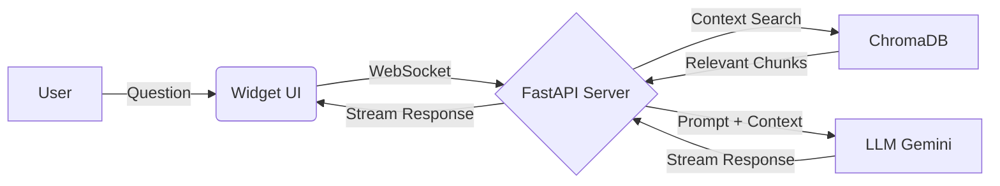

<div align="center">

# 🧠 SmartEmbed

**Turn any website into a smart AI assistant in 30 seconds**

<div align="center">
  
  
  
  
  
</div>

<br />


<br />

[View Demo](https://ai-widget-saas-fawn.vercel.app) · [Report Bug](https://github.com/Samsa016/ai-widget-saas/issues)

</div>

---

## 📖 About The Project

**SmartEmbed** is an open-source SaaS solution that allows you to create an AI chatbot based on your website's content instantly.

The system automatically crawls (parses) the provided URL, vectorizes the text, and utilizes **RAG (Retrieval-Augmented Generation)** to provide accurate, context-aware answers to visitor questions. You get a ready-made JS code snippet that can be embedded into any website (HTML, WordPress, Tilda, React, etc.).

### 🔥 Key Features
- **RAG Architecture**: The bot answers strictly based on your website's text (Hallucination-free).
- **Real-time Streaming**: Answers are streamed instantly via WebSocket, just like ChatGPT.
- **No-Code Dashboard**: Create bots and customize colors/greetings without coding.
- **Data Isolation**: Full Multi-tenancy support (data from different projects never mixes).
- **Lightweight Widget**: Built with Shadow DOM to ensure no style conflicts with the host site.

---

## 🏗 Tech Stack

Built with modern tools for speed, scalability, and developer experience:

### Backend (The Brains)
| Tech | Purpose |
|------------|------------|
| **Python 3.11** | Core logic |
| **FastAPI** | High-performance async API |
| **ChromaDB** | Vector Database (In-memory / Persistent) |
| **LangChain / OpenAI** | LLM Integration (Google Gemini 2.0 Flash) |
| **BeautifulSoup4** | Intelligent HTML Parsing |

### Frontend (The Face)
| Tech | Purpose |
|------------|------------|
| **React 19 + Vite** | Lightning-fast build & Reactive UI |
| **TypeScript** | Type safety & reliability |
| **Tailwind CSS** | Styling within Shadow DOM |
| **Framer Motion** | Smooth chat animations |
| **WebSocket** | Real-time bidirectional communication |

---

## 🚀 Quick Start (Local Development)

Want to run SmartEmbed on your machine? Follow these steps.

### Prerequisites
* Python 3.10+
* Node.js 18+
* API Key from OpenRouter (or OpenAI)

### 1. Backend Setup

```bash
# Clone the repository
git clone [https://github.com/Samsa016/ai-widget-saas.git](https://github.com/Samsa016/ai-widget-saas.git)
cd ai-widget-saas/server

# Create virtual environment
python -m venv venv
source venv/bin/activate  # For Windows: venv\Scripts\activate

# Install dependencies
pip install -r requirements.txt

# Create env file with your key
echo "OPENROUTER_API_KEY=your_key_here" > .env

# Start the server
uvicorn main:app --reload --port 8000

```

### 2. Frontend Setup

```bash
cd ../widget

# Install packages
npm install

# Start development server
npm run dev

```

The Dashboard will be available at: `http://localhost:5173`

---

## 🔌 How to Embed

After creating a project in the Dashboard, you will receive a code snippet. Simply add it before the closing `</body>` tag of your website:

```html
<script 
  type="module"
  src="[https://ai-widget-saas.onrender.com/widget.js](https://ai-widget-saas.onrender.com/widget.js)" 
  data-id="YOUR_PROJECT_ID">
</script>

```

---

## 🧩 Architecture

How data turns into answers:



1. **Scraping**: The server downloads the site and cleans the HTML.
2. **Chunking**: Text is split into overlapping chunks (1000 chars).
3. **Embedding**: Chunks are converted into vectors and stored in ChromaDB.
4. **Retrieval**: When asked, the server finds the most semantically similar vectors.
5. **Generation**: The LLM generates an answer based *only* on the found context.

---

## 🗺 Roadmap

* [x] MVP: Scraping, Vector DB, Chat Interface
* [x] Response Streaming (WebSocket)
* [x] UI Customization (Colors & Greetings)
* [x] Deployment (Render + Vercel)
* [ ] Markdown Support in messages
* [ ] Chat History (Session Memory)
* [ ] PDF Document Parsing
* [ ] Analytics Dashboard

---

## 🤝 Contributing

Contributions are welcome!

1. Fork the repository.
2. Create a branch (`git checkout -b feature/AmazingFeature`).
3. Commit your changes (`git commit -m 'Add AmazingFeature'`).
4. Push to the branch (`git push origin feature/AmazingFeature`).
5. Open a Pull Request.

## 📄 License

Distributed under the MIT License. See `LICENSE` for more information.

```

